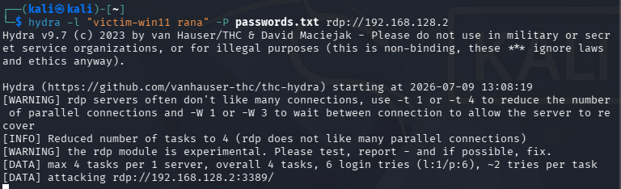
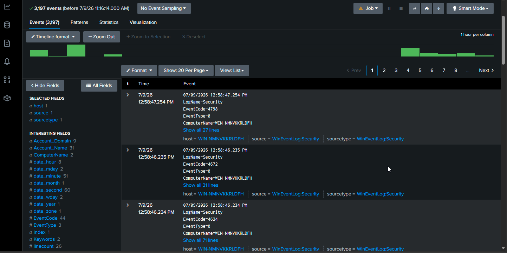
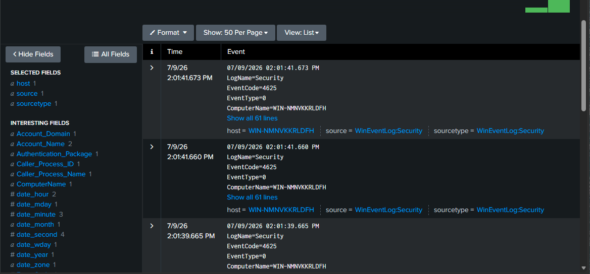
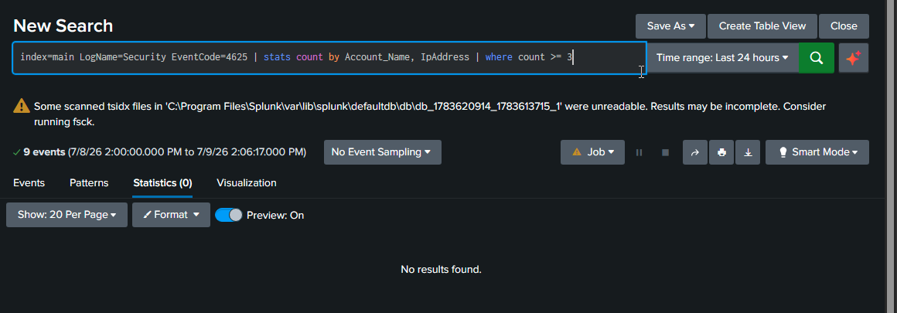
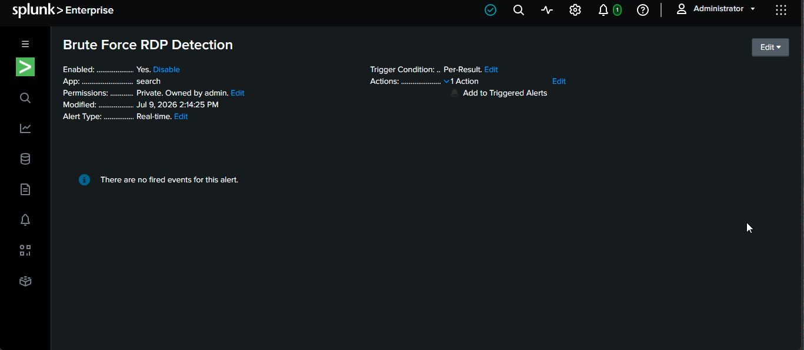
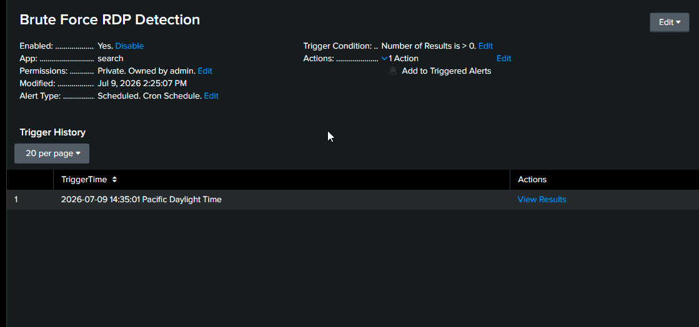

# Incident Report: Simulated RDP Brute-Force Attack

**Analyst:** Faisal Saeed
**Environment:** Home SOC Lab (isolated virtual environment)
**Date of Exercise:** July 2026
**Report Status:** Closed — Simulated Exercise

---

## 1. Executive Summary

This report documents a simulated brute-force attack against a Remote Desktop Protocol (RDP) service, performed in a fully isolated home lab environment for security training purposes. The attack was detected using Splunk Enterprise (SIEM), and a custom detection rule was built and validated to automatically flag this type of activity in the future.

**Outcome:** Attack detected successfully. No real systems or data were at risk — the target was a personally owned, isolated virtual machine.

---

## 2. Lab Environment

| Component | Details |
|---|---|
| Hypervisor | UTM (Apple Silicon / ARM64) |
| Attacker Machine | Kali Linux (ARM64), IP: `192.168.128.3` |
| Victim Machine | Windows 11 (ARM64), IP: `192.168.128.2` |
| SIEM | Splunk Enterprise (installed on victim VM) |
| Network Mode | Host-Only (fully isolated — no internet, no access to real home network) |

The lab was intentionally isolated at the network level to guarantee the simulated attack could never reach any real-world system.

---

## 3. Attack Simulation

### 3.1 Objective
Simulate a credential brute-force attack against RDP (a common real-world attack vector used by ransomware groups and opportunistic attackers to gain initial access to exposed systems).

### 3.2 Tools Used
- **Hydra** — password brute-forcing tool
- **Nmap** — used beforehand to confirm port 3389 (RDP) was reachable
- **xfreerdp** — used to validate manual RDP connectivity

### 3.3 Attack Steps
1. Confirmed network connectivity and RDP availability between attacker and victim VMs using `nmap`.

   

2. Enabled RDP on the victim machine to create a target service.
3. Ran Hydra against the victim's RDP service using a custom wordlist of common weak passwords:
   ```
   hydra -l "victim-win11 rana" -P passwords.txt rdp://192.168.128.2
   ```

   

4. Attack completed with 0 valid passwords found (expected — the real account password was not in the wordlist).

---

## 4. Detection

### 4.1 Log Source
Windows Security Event Log, forwarded to Splunk via local monitoring input.



### 4.2 Relevant Event
**Event ID 4625** — "An account failed to log on." Multiple instances of this event were generated in a short time window, one for each password attempt made by Hydra.



### 4.3 Detection Query
```spl
index=main LogName=Security EventCode=4625
| stats count by Account_Name, Source_Network_Address
| where count >= 3
```

This query groups failed logon attempts by target account and source IP address, and flags any combination with 3 or more failures — a pattern consistent with automated brute-force activity rather than normal human error (e.g., a single mistyped password).



### 4.4 Sample Findings

| Time | Account Targeted | Source IP | Failure Reason |
|---|---|---|---|
| 2026-07-09 14:01:39 | victim-win11 rana | 192.168.128.3 | Unknown user name or bad password |
| 2026-07-09 14:01:41 | victim-win11 rana | 192.168.128.3 | Unknown user name or bad password |
| 2026-07-09 14:01:41 | victim-win11 rana | 192.168.128.3 | Unknown user name or bad password |

*(Full event set available in Splunk search history / screenshots folder)*

---

## 5. Alerting

The detection query above was saved as a **scheduled Splunk alert**:

- **Alert Name:** Brute Force RDP Detection
- **Schedule:** Runs every 5 minutes (Cron: `*/5 * * * *`)
- **Trigger Condition:** Number of results > 0
- **Action:** Add to Triggered Alerts



The alert was validated by re-running the attack and confirming it fired correctly, with a matching timestamp in Splunk's Trigger History.



---

## 6. MITRE ATT&CK Mapping

| Technique | ID | Description |
|---|---|---|
| Brute Force | T1110 | Credential guessing via automated tooling against a network-facing login service |
| Valid Accounts | T1078 | Would apply if a weak password had been successfully guessed |
| Remote Services: RDP | T1021.001 | RDP used as the target service for access attempts |

---

## 7. Recommendations (as would apply in a real environment)

1. **Account lockout policy** — Lock accounts after a small number of failed attempts to slow/stop brute-force attacks.
2. **Multi-factor authentication (MFA)** — Prevents password-only compromise even if credentials are guessed.
3. **Network Level Authentication (NLA)** — Should remain enabled on production RDP services (it was intentionally disabled in this lab to generate clean logs for demonstration purposes).
4. **Restrict RDP exposure** — RDP should never be directly exposed to the public internet; use a VPN or bastion host instead.
5. **Continuous monitoring** — The alert built in this exercise demonstrates how this type of activity can be caught automatically in near real-time.

---

## 8. Lessons Learned / Troubleshooting Notes

During this exercise, several real-world troubleshooting challenges were encountered and resolved, which mirror the kind of diagnostic work a SOC analyst performs regularly:

- **Failed logons were not appearing in Splunk initially.** Root cause analysis revealed the issue was not with Splunk or the audit policy, but with RDP itself being unreachable — Windows had classified the virtual network adapter as a "Public" network, which restricted the Windows Firewall rules for RDP regardless of individual rule state.
- **Resolution:** Diagnosed using a layered approach — `nmap`/`nc` port testing, Windows Firewall rule review, and finally `Get-NetConnectionProfile` in PowerShell, which revealed the network category as the true blocker. Applied a Local Group Policy setting to permanently classify unidentified networks as Private, resolving the issue.

This troubleshooting process — moving from a broad symptom (no logs) to a root cause (network profile misconfiguration) — reflects the kind of methodical investigation used in real security incident response.

---

## 9. Appendix

- Screenshots of Splunk search results, alert configuration, and attack execution are included in the `/screenshots` folder of this repository.
- Password wordlist used (`passwords.txt`) contained only common, publicly known weak passwords for demonstration purposes.
